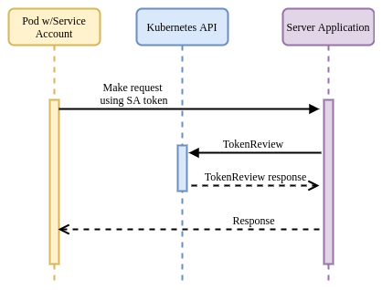

# Kubernetes TokenReview API with Minikube

Simple demo of using [Kubernetes TokenReview API](https://kubernetes.io/docs/reference/kubernetes-api/authentication-resources/token-review-v1/) to validate a k8s service account JWT bearer token.

This repo is nothing new other than a way to demonstrate how you can validate an k8s sa token using both a standard `JWT Validator` and the `TokenReview` API

The JWT validator simply verifies if a token is signed correctly and has some claims.  The signature validation is done by retrieving the JWKs certs directly from the target kubernetes API server endpoint or via local JWK file.

The TokenReview is done by invoking the kubernetes api endpoint api remotely.  If you are running 'incluster' you ofcourse dont' have to do all this with ngrok.

--this repo is nothing new; just wrote it here for my ref--



(image taken from [vmware article](https://tanzu.vmware.com/developer/guides/platform-security-workload-identity/))

---


Other references

- [Kubernetes WebHook Authentication/Authorization Minikube HelloWorld](https://github.com/salrashid123/k8s_webhook_helloworld)
- [Using kubernetes TokenReviews go api on pod](https://gist.github.com/salrashid123/75c22afcbdbf1b706ab76d9063122429)
- [Using Kubernetes Service Accounts for Google Workload Identity Federation](https://github.com/salrashid123/k8s_federation_with_gcp)


### Setup

First install the following on your laptop

* [minikube](https://minikube.sigs.k8s.io/docs/)
* optionally [jq](https://stedolan.github.io/jq/)


```bash
export DISCOVERY_URL="https://some-address"
## i used kvm2, you can use anything
minikube start --driver=kvm2 --embed-certs \
    --extra-config=apiserver.service-account-jwks-uri=$DISCOVERY_URL/openid/v1/jwks \
    --extra-config=apiserver.service-account-issuer=$DISCOVERY_URL   

# (optional steps) if you want to expose the endpoint directly via proxy, create a proxy back
## kubectl proxy --port=8080  --accept-paths="^/\.well-known\/openid-configuration|^/openid\/v1\/jwks|^\/apis\/authentication.k8s.io\/v1\/tokenreviews" 
## to allow anon access to tokenreview api remotely w/o creds.
## kubectl create clusterrolebinding oidc-reviewer --clusterrole=system:service-account-issuer-discovery --group=system:unauthenticated
# test that you can see the jwks endpoint/oidc config

## export the oidc config and jwk
kubectl get --raw /.well-known/openid-configuration | jq -r .issuer
kubectl get --raw /openid/v1/jwks | jq '.'  > jwk.json
```

for me the jwk was

```json
{
  "keys": [
    {
      "use": "sig",
      "kty": "RSA",
      "kid": "yHwD6nFW5gCsPg6dtdqrhm18iAtj_0rkX5CJNGvfPF4",
      "alg": "RS256",
      "n": "5OGPUXHd3Fq9Xi9UnKQjV-vpIWcmrQPBLxbmn_ol3qu8SuF-RASKgTMZajktlp4HH8GmhDXNFUR8i2oz1vRMhwVgvikHZ-R0ZbrY-lMQzQ5cOpgyvWKys6nccAY84Tn51Nd1QQnR78WxZZ0RYOwtCx0_NuAF8sgjJa55cN_s-sN27n1aXUzt4j5asxtU9co7tQ5SacvAJnBkXmvAQx8A74tSeg-sHaxA4Gms-5Men79S_RUP1gPc75ti78_PKCAtSNhuPUa-8YkfKGp-jdv15g8yWgwX650lMJuwZezwSVYbwpNtZkpolbHGhpvBHUldt_IyFjMF64ZzC2uz9oPHRQ",
      "e": "AQAB"
    }
  ]
}
```

apply a sample deployment which mounts a svc account token to `/var/run/secrets/iot-token`

```bash
kubectl apply -f my-deployment.yaml
```

In my case, i saw

```bash
$ kubectl get po
NAME                                READY   STATUS    RESTARTS   AGE
myapp-deployment-6445ccd844-7vs45   1/1     Running   0          10s
myapp-deployment-6445ccd844-lb627   1/1     Running   0          10s


export SA_TOKEN=`kubectl exec -n default   $(kubectl get pod -n default -l type=myapp -o jsonpath='{.items[0].metadata.name}')   --   cat /var/run/secrets/iot-token/iot-token`


$ echo $SA_TOKEN
eyJhbGciOiJSUzI1NiIsImtpZCI6InlId0Q2bkZXNWdDc1BnNmR0ZHFyaG0xOGlBdGpfMHJrWDVDSk5HdmZQRjQifQ.eyJhdWQiOlsiZ2NwLXN0cy1hdWRpZW5jZSJdLCJleHAiOjE3MzA3Mjc5MzMsImlhdCI6MTczMDcyMDczMywiaXNzIjoiaHR0cHM6Ly9zb21lLWFkZHJlc3MiLCJqdGkiOiI3ZGIxZDFmZi01MmZhLTQ4MzItYjVlOS0wMDY3NDI2YjE3YmUiLCJrdWJlcm5ldGVzLmlvIjp7Im5hbWVzcGFjZSI6ImRlZmF1bHQiLCJub2RlIjp7Im5hbWUiOiJtaW5pa3ViZSIsInVpZCI6IjJkMGI1ODg1LWVkNDUtNGFiMy1iNDViLWRkNzgyMGI3ZTk3NCJ9LCJwb2QiOnsibmFtZSI6Im15YXBwLWRlcGxveW1lbnQtNjQ0NWNjZDg0NC03dnM0NSIsInVpZCI6IjM1Mjc1Zjc0LWZhNTgtNDM5Ni04ZDE1LThlMjI0ZGZkZjJlYSJ9LCJzZXJ2aWNlYWNjb3VudCI6eyJuYW1lIjoic3ZjMS1zYSIsInVpZCI6IjA5NzNlN2IwLWRkZDktNDc0Mi1hZWUxLWJmY2UzZDVkMWE0YSJ9fSwibmJmIjoxNzMwNzIwNzMzLCJzdWIiOiJzeXN0ZW06c2VydmljZWFjY291bnQ6ZGVmYXVsdDpzdmMxLXNhIn0.Vr1k1xVvGL2jNUIl0KGRiuUBBfwXwUT_pHkirQ75xLUoViqZY7OKbMTxJSHJiJw6TMcFg0jShT13PPq-zbvM8bw6urndodLv3GGXzk254O8GZ1Uyh0QE9Nv-xiVoxt5LGOYqGHwg2Uj-og9vzZ27fsVQWU0xlvGHkGBXgHvrBSvjc8uQHRQxRmO6o3CRxq5SgF8z35EryH6irpu5b05CIuJnPrMxork25QhsrbDtjPaHQ9pSMRm4DoP4CVKki1GCqyHqj8kJKpy4gkZq45IiyLL3Dlnu8DMawiFJayDgJFvi2b_TnUTHWcSi6yGeYgFUfu9x-5j12HcMPeU7rsAiUQ
```

Note the JWT there is in the form

```json
{
  "alg": "RS256",
  "kid": "yHwD6nFW5gCsPg6dtdqrhm18iAtj_0rkX5CJNGvfPF4"
}.
{
  "aud": [
    "gcp-sts-audience"
  ],
  "exp": 1730727933,
  "iat": 1730720733,
  "iss": "https://some-address",
  "jti": "7db1d1ff-52fa-4832-b5e9-0067426b17be",
  "kubernetes.io": {
    "namespace": "default",
    "node": {
      "name": "minikube",
      "uid": "2d0b5885-ed45-4ab3-b45b-dd7820b7e974"
    },
    "pod": {
      "name": "myapp-deployment-6445ccd844-7vs45",
      "uid": "35275f74-fa58-4396-8d15-8e224dfdf2ea"
    },
    "serviceaccount": {
      "name": "svc1-sa",
      "uid": "0973e7b0-ddd9-4742-aee1-bfce3d5d1a4a"
    }
  },
  "nbf": 1730720733,
  "sub": "system:serviceaccount:default:svc1-sa"
}
```


to validate it two ways:

```bash
$ go run main.go --jwk=../jwk.json --token=$SA_TOKEN
Using JWT Validation
OIDC signature verified  with Audience [[gcp-sts-audience]] Issuer [https://some-address] and PodName [35275f74-fa58-4396-8d15-8e224dfdf2ea]

Using TokenReview API
TokenReview Verified with user UID [0973e7b0-ddd9-4742-aee1-bfce3d5d1a4a];  Authenticated: true
```


